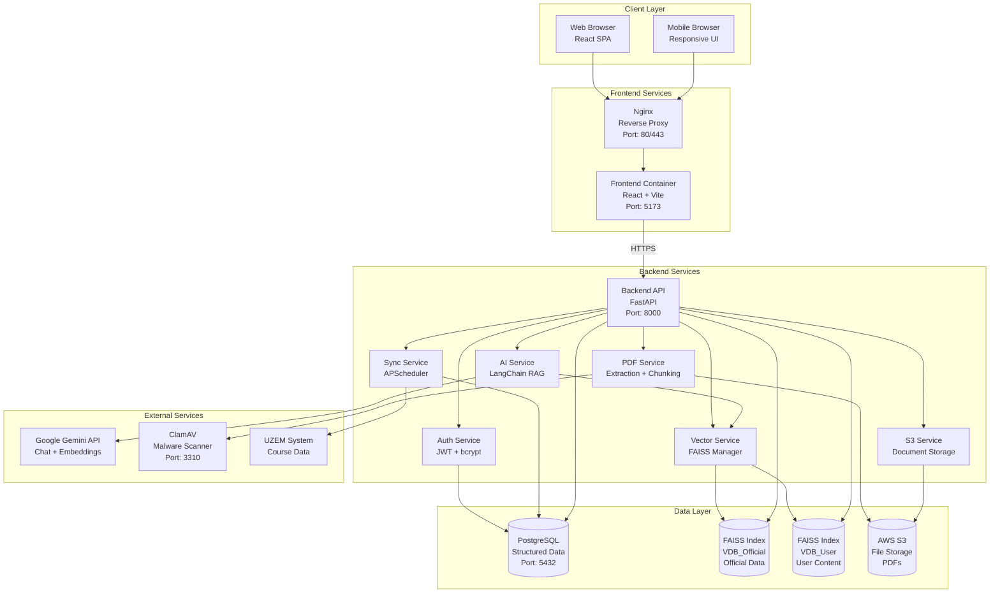
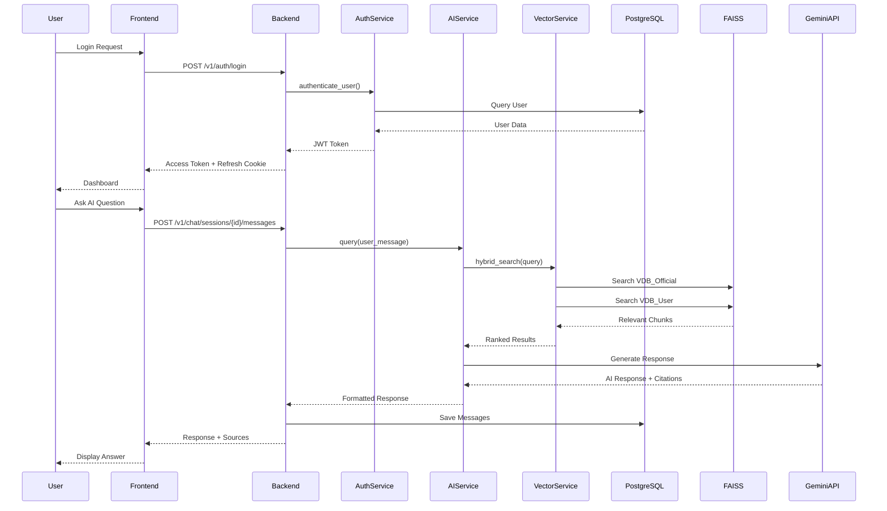

# KAMPÜS+ Platform - System Architecture

**Version**: 1.0.0  
**Last Updated**: 2025-01-XX  
**Status**: Active Development

---

## 📋 Table of Contents

1. [Overview](#overview)
2. [System Architecture Diagram](#system-architecture-diagram)
3. [Component Architecture](#component-architecture)
4. [Data Flow](#data-flow)
5. [Service Communication](#service-communication)
6. [Technology Stack](#technology-stack)
7. [Deployment Architecture](#deployment-architecture)
8. [Security Architecture](#security-architecture)

---

## Overview

KAMPÜS+ is a hybrid intelligence platform that merges official university data with user-generated content through an AI-powered assistant. The system uses a microservices-oriented architecture with clear separation between frontend, backend API, database, and vector stores.

### Key Architectural Principles

- **Separation of Concerns**: Frontend (React), Backend (FastAPI), Database (PostgreSQL), Vector Store (FAISS)
- **Dual Vector Stores**: Official data (VDB_Official) and user content (VDB_User) for clear source attribution
- **Security by Default**: JWT authentication, HTTPS enforcement, data anonymization
- **Test-First Development**: All features require tests before implementation
- **Observability**: Structured logging, health checks, metrics

---

## System Architecture Diagram

### High-Level Architecture



### Component Interaction Flow



---

## Component Architecture

### Backend Components

#### 1. API Layer (`backend/src/api/routes/`)

**Responsibilities**: HTTP request handling, validation, response formatting

- **`auth.py`**: Authentication endpoints (register, login, refresh, logout, password reset)
- **`chat.py`**: AI chatbot endpoints (sessions, messages)
- **`courses.py`**: Course information endpoints
- **`documents.py`**: PDF upload/management endpoints (Phase 5)
- **`forum.py`**: Anonymous forum endpoints (Phase 6)
- **`sync.py`**: Data synchronization endpoints (Phase 7)
- **`instructor.py`**: Instructor panel endpoints (Phase 8)
- **`health.py`**: Health check endpoints

**Dependencies**: 
- FastAPI routers
- Pydantic models for validation
- `get_current_user()` dependency for auth

#### 2. Service Layer (`backend/src/services/`)

**Responsibilities**: Business logic, external API calls, data processing

- **`auth_service.py`**: User authentication, JWT generation, password hashing
- **`ai_service.py`**: LangChain RAG pipeline, prompt management, response formatting
- **`vector_service.py`**: FAISS index management, similarity search, embedding generation
- **`pdf_service.py`**: PDF text extraction, chunking, vectorization
- **`s3_service.py`**: AWS S3 upload/download, pre-signed URL generation
- **`anonymization_service.py`**: PII detection and removal
- **`sync_service.py`**: UZEM/announcement data synchronization (Phase 7)
- **`forum_service.py`**: Anonymous identity management (Phase 6)

**Dependencies**:
- Database sessions (SQLAlchemy)
- External APIs (Gemini, S3)
- Vector stores (FAISS)

#### 3. Core Layer (`backend/src/core/`)

**Responsibilities**: Configuration, database, security, logging

- **`config.py`**: Environment variable management (Pydantic Settings)
- **`database.py`**: PostgreSQL connection pool, session management
- **`security.py`**: Password hashing (bcrypt), JWT encode/decode
- **`logging.py`**: Structured JSON logging, request ID tracking
- **`dependencies.py`**: FastAPI dependencies (get_current_user, require_role)

#### 4. Model Layer (`backend/src/models/`)

**Responsibilities**: Database schema definitions (SQLAlchemy ORM)

- **`user.py`**: User, RefreshToken models
- **`course.py`**: Course, Enrollment models
- **`document.py`**: OfficialDocument, UserDocument, VectorEmbedding models
- **`conversation.py`**: ConversationSession, ChatMessage models
- **`forum.py`**: ForumPost, AnonymousMapping models
- **`sync.py`**: SyncJob, AuditLog models

### Frontend Components

#### 1. Pages (`frontend/src/pages/`)

**Responsibilities**: Top-level page components, routing

- **`Dashboard.tsx`**: Student dashboard (courses, quick actions)
- **`InstructorDashboard.tsx`**: Instructor dashboard (courses, analytics preview)
- **`ChatPage.tsx`**: Full-page chat interface
- **`DocumentsPage.tsx`**: Document management (Phase 5)
- **`ForumPage.tsx`**: Forum interface (Phase 6)
- **`LoginPage.tsx`**: Login form wrapper
- **`RegisterPage.tsx`**: Registration form wrapper

#### 2. Components (`frontend/src/components/`)

**Responsibilities**: Reusable UI components

**Auth Components**:
- **`LoginForm.tsx`**: Email/password login form
- **`RegisterForm.tsx`**: Registration form with validation
- **`ProtectedRoute.tsx`**: Route guard with role-based access

**Chat Components**:
- **`ChatInterface.tsx`**: Main chat UI (message list, input)
- **`MessageBubble.tsx`**: Message display with source citations
- **`SessionList.tsx`**: Chat history sidebar

**Document Components** (Phase 5):
- **`UploadForm.tsx`**: PDF upload with drag-and-drop
- **`DocumentList.tsx`**: Document table/grid with status

**Forum Components** (Phase 6):
- **`ThreadList.tsx`**: Forum thread list
- **`ThreadView.tsx`**: Thread detail with replies
- **`NewThreadForm.tsx`**: Create new thread form

#### 3. Services (`frontend/src/api/`)

**Responsibilities**: API communication, token management

- **`config.ts`**: Axios instance with JWT interceptor, base URL
- API service functions (auth, chat, documents, forum)

#### 4. Contexts (`frontend/src/contexts/`)

**Responsibilities**: Global state management

- **`AuthContext.tsx`**: Authentication state (user, token, isAuthenticated)
- **`useAuth.ts`**: Authentication hook

---

## Data Flow

### 1. User Authentication Flow

```
User → Frontend (LoginForm) 
  → POST /v1/auth/login 
  → Backend (auth.py) 
  → AuthService.authenticate_user() 
  → PostgreSQL (User lookup) 
  → AuthService (JWT generation) 
  → Backend (Set httpOnly cookie) 
  → Frontend (Store access token) 
  → Dashboard
```

### 2. AI Chat Query Flow

```
User → Frontend (ChatInterface) 
  → POST /v1/chat/sessions/{id}/messages 
  → Backend (chat.py) 
  → AnonymizationService (PII removal) 
  → AIService.query() 
  → VectorService.hybrid_search() 
    → FAISS VDB_Official (official data search)
    → FAISS VDB_User (user content search)
  → AIService (merge & rank results) 
  → GeminiAPI (generate response) 
  → AIService (format with citations) 
  → Backend (save to PostgreSQL) 
  → Frontend (display response + sources)
```

### 3. PDF Upload Flow (Phase 5)

```
User → Frontend (UploadForm) 
  → POST /v1/documents (multipart/form-data) 
  → Backend (documents.py) 
  → ClamAV (malware scan) 
  → S3Service.upload() 
  → AWS S3 (store file) 
  → PostgreSQL (create UserDocument record, status=pending) 
  → Background Task (PDF processing)
    → S3Service.download() 
    → PDFService.extract_text() 
    → PDFService.chunk() 
    → VectorService.generate_embedding() 
    → FAISS VDB_User (add vectors) 
    → PostgreSQL (update status=completed)
  → Frontend (display processing status)
```

### 4. Data Synchronization Flow (Phase 7)

```
APScheduler (cron: every 2 hours) 
  → SyncService.execute_sync() 
  → UZEMAdapter.fetch() 
  → SyncService.parse() 
  → PostgreSQL (create OfficialDocument records) 
  → Background Task (vectorization)
    → PDFService.chunk() 
    → VectorService.generate_embedding() 
    → FAISS VDB_Official (add vectors)
  → PostgreSQL (update SyncJob status=completed)
```

---

## Service Communication

### Internal Communication (Backend Services)

| Service | Communicates With | Protocol | Purpose |
|---------|------------------|----------|---------|
| `auth_service` | PostgreSQL | SQLAlchemy (async) | User authentication, token management |
| `ai_service` | `vector_service` | Python function calls | Retrieve relevant documents |
| `ai_service` | Gemini API | HTTPS REST | Generate AI responses |
| `vector_service` | FAISS indexes | In-memory | Similarity search |
| `pdf_service` | `vector_service` | Python function calls | Generate embeddings |
| `s3_service` | AWS S3 | boto3 (HTTPS) | File storage |
| `sync_service` | UZEM/Announcements | HTTPS/Scraping | Fetch official data |

### External Communication

| Service | External System | Protocol | Authentication |
|---------|----------------|----------|---------------|
| Backend API | Google Gemini API | HTTPS REST | API Key (GOOGLE_API_KEY) |
| Backend API | AWS S3 | HTTPS (boto3) | Access Key + Secret Key |
| Backend API | ClamAV | TCP Socket (port 3310) | None (internal) |
| Backend API | UZEM System | HTTPS/Scraping | University credentials |
| Frontend | Backend API | HTTPS REST | JWT Bearer token |

### API Endpoint Summary

#### Authentication (`/v1/auth/*`)
- `POST /auth/register` - User registration
- `POST /auth/login` - User login (returns JWT)
- `POST /auth/refresh` - Refresh access token
- `POST /auth/logout` - Logout (revoke token)
- `POST /auth/verify-email` - Email verification
- `POST /auth/forgot-password` - Password reset request
- `POST /auth/reset-password` - Password reset

#### Chat (`/v1/chat/*`)
- `POST /chat/sessions` - Create new chat session
- `GET /chat/sessions` - List user's chat sessions
- `GET /chat/sessions/{id}` - Get session with message history
- `POST /chat/sessions/{id}/messages` - Send message, get AI response
- `DELETE /chat/sessions/{id}` - Delete session (soft-delete)

#### Courses (`/v1/courses/*`)
- `GET /courses/my-courses` - Get enrolled courses for student

#### Documents (`/v1/documents/*`) - Phase 5
- `POST /documents` - Upload PDF document
- `GET /documents` - List user's documents
- `GET /documents/{id}` - Get document metadata
- `GET /documents/{id}/download` - Get pre-signed download URL
- `DELETE /documents/{id}` - Delete document

#### Forum (`/v1/forum/*`) - Phase 6
- `POST /forum/threads` - Create new thread
- `GET /forum/threads` - List threads (pagination)
- `GET /forum/threads/{id}` - Get thread with replies
- `POST /forum/threads/{id}/replies` - Reply to thread
- `GET /forum/search` - Search forum content

#### Sync (`/v1/sync/*`) - Phase 7 (Admin only)
- `GET /sync/jobs` - List sync job history
- `POST /sync/jobs` - Manually trigger sync
- `GET /sync/jobs/{id}` - Get sync job details

#### Instructor (`/v1/instructor/*`) - Phase 8
- `GET /instructor/dashboard` - Instructor dashboard
- `GET /instructor/courses/{id}/analytics` - Course analytics
- `POST /instructor/courses/{id}/documents` - Upload course material

#### Health (`/health/*`)
- `GET /health` - Basic health check
- `GET /health/ready` - Readiness probe (DB + vector stores)
- `GET /health/live` - Liveness probe

---

## Technology Stack

### Backend

| Component | Technology | Version | Purpose |
|-----------|-----------|---------|----------|
| Framework | FastAPI | 0.104+ | REST API framework |
| Language | Python | 3.11+ | Backend language |
| Database | PostgreSQL | 15+ | Structured data storage |
| ORM | SQLAlchemy | 2.0+ | Database abstraction |
| Migrations | Alembic | Latest | Database schema versioning |
| Vector Store | FAISS | Latest | Similarity search |
| AI Framework | LangChain | 1.0+ | RAG pipeline orchestration |
| LLM Provider | Google Gemini | 2.5 Flash | Chat model |
| Embeddings | Google Gemini | text-embedding-004 | Vector embeddings (768 dims) |
| File Storage | AWS S3 | boto3 | Document storage |
| Malware Scanner | ClamAV | Latest | PDF security scanning |
| Scheduler | APScheduler | Latest | Periodic sync jobs |
| Testing | pytest | Latest | Unit/integration tests |

### Frontend

| Component | Technology | Version | Purpose |
|-----------|-----------|---------|----------|
| Framework | React | 18+ | UI framework |
| Language | TypeScript | Latest | Type-safe JavaScript |
| Build Tool | Vite | Latest | Fast build tool |
| Styling | TailwindCSS | Latest | Utility-first CSS |
| HTTP Client | Axios | Latest | API communication |
| Routing | React Router | 6+ | Client-side routing |
| Markdown | react-markdown | 9+ | AI response formatting |
| Testing | Jest + RTL | Latest | Unit/component tests |

### DevOps

| Component | Technology | Purpose |
|-----------|-----------|---------|
| Containerization | Docker | Application packaging |
| Orchestration | Docker Compose | Multi-container management |
| Reverse Proxy | Nginx | HTTPS termination, routing |
| CI/CD | GitHub Actions | Automated testing/deployment |

---

## Deployment Architecture

### Development Environment

```
┌─────────────────────────────────────────┐
│         Docker Compose Network          │
│                                         │
│  ┌──────────────┐    ┌──────────────┐  │
│  │   Frontend    │───▶│   Backend    │  │
│  │  (Port 5173)  │    │  (Port 8000) │  │
│  └──────────────┘    └──────┬───────┘  │
│                              │          │
│                    ┌─────────┴─────────┐│
│                    │   PostgreSQL      ││
│                    │   (Port 5432)     ││
│                    └───────────────────┘│
│                                         │
│  ┌───────────────────────────────────┐ │
│  │  FAISS Indexes (Volume Mount)     │ │
│  │  - VDB_Official.index             │ │
│  │  - VDB_User.index                 │ │
│  └───────────────────────────────────┘ │
└─────────────────────────────────────────┘
```

### Production Environment (Planned)

```
┌─────────────────────────────────────────────────────┐
│                    Load Balancer                     │
│                  (HTTPS: 443)                       │
└────────────────────┬─────────────────────────────────┘
                     │
         ┌───────────┴───────────┐
         │                        │
    ┌────▼────┐              ┌────▼────┐
    │  Nginx  │              │  Nginx  │
    │ (Node 1)│              │ (Node 2)│
    └────┬────┘              └────┬────┘
         │                        │
    ┌────▼────┐              ┌────▼────┐
    │ Backend │              │ Backend │
    │ (FastAPI)│             │ (FastAPI)│
    └────┬────┘              └────┬────┘
         │                        │
    ┌────▼────────────────────────▼────┐
    │      PostgreSQL (Primary)        │
    │      + Replica (Read-only)       │
    └──────────────────────────────────┘
    
    ┌──────────────────────────────────┐
    │      FAISS Indexes (Shared)     │
    │      (NFS or S3-backed)          │
    └──────────────────────────────────┘
    
    ┌──────────────────────────────────┐
    │         AWS S3 Bucket            │
    │      (Document Storage)          │
    └──────────────────────────────────┘
```

---

## Security Architecture

### Authentication & Authorization

1. **JWT Token Flow**:
   - Access token: 15 minutes expiry, stored in memory (frontend)
   - Refresh token: 7 days expiry, httpOnly cookie (backend)
   - Token rotation on refresh

2. **Role-Based Access Control (RBAC)**:
   - Roles: `student`, `instructor`, `admin`
   - Endpoint protection via `require_role()` dependency
   - Frontend route protection via `ProtectedRoute` component

3. **Password Security**:
   - bcrypt hashing (cost factor 12)
   - Minimum 8 characters
   - University email validation

### Data Security

1. **Encryption**:
   - HTTPS mandatory (TLS 1.2+)
   - S3 encryption at rest (SSE-S3 or SSE-KMS)
   - Database connection encryption (SSL)

2. **Anonymization**:
   - PII removal before AI processing (constitutional requirement)
   - No LLM prompt logging
   - Anonymous forum identities (HMAC-SHA256)

3. **Access Control**:
   - User documents: ACL enforced (user_id matching)
   - Official documents: Read-only for students
   - Forum posts: Anonymous to public, real identity for moderators only

### Security Scanning

1. **Malware Detection**:
   - ClamAV synchronous scanning (PDF uploads)
   - Reject infected files before S3 upload
   - Quarantine for admin review

2. **Input Validation**:
   - Pydantic models for all request bodies
   - File type validation (MIME type + magic bytes)
   - Size limits (25MB per file, 500MB per user)

3. **Rate Limiting** (Planned):
   - 100 requests/minute per user
   - 10 AI queries/minute per user
   - 1000 requests/minute per IP

---

## Data Storage Architecture

### PostgreSQL Database

**Purpose**: Structured relational data

**Tables**:
- `users` - User accounts (students, instructors, admins)
- `refresh_tokens` - JWT refresh token management
- `courses` - University courses
- `enrollments` - Student-course relationships
- `official_documents` - Synced university content
- `user_documents` - Uploaded PDFs metadata
- `vector_embeddings` - Vector metadata (FAISS index references)
- `conversation_sessions` - Chat sessions
- `chat_messages` - Individual messages
- `forum_posts` - Forum threads and replies
- `anonymous_mappings` - Forum anonymity mapping
- `sync_jobs` - Data synchronization history
- `audit_logs` - Security audit trail

**Indexes**: Optimized for frequent queries (user.email, course.code, document.user_id)

### FAISS Vector Stores

**Purpose**: Semantic search for AI RAG pipeline

**VDB_Official**:
- Contains: Official university documents (UZEM, announcements, schedules)
- Embedding model: Google Gemini text-embedding-004 (768 dimensions)
- Index type: IndexFlatL2 (can upgrade to IndexIVFFlat for performance)
- Size: ~10K-100K documents expected

**VDB_User**:
- Contains: User-uploaded PDFs, forum posts
- Embedding model: Google Gemini text-embedding-004 (768 dimensions)
- Index type: IndexFlatL2
- Access control: User-level isolation (user_id filtering)
- Size: ~1K-10K documents per user

**Persistence**: Disk-based indexes (`backend/data/vectors/`), loaded at startup

### AWS S3 Storage

**Purpose**: File storage for uploaded PDFs

**Bucket Structure**:
```
s3://kampus-plus-uploads-{env}/
  ├── user-uploads/
  │   ├── {user_id}/
  │   │   ├── {document_id}.pdf
  │   │   └── ...
  │   └── ...
  └── course-materials/
      ├── {course_id}/
      └── ...
```

**Features**:
- Encryption at rest (SSE-S3 or SSE-KMS)
- Pre-signed URLs (15-minute expiry for downloads)
- Versioning enabled
- Lifecycle policies (optional: archive old documents)

---

## Monitoring & Observability

### Logging

**Format**: Structured JSON logging

**Fields**:
- `timestamp` - ISO 8601 format
- `level` - DEBUG, INFO, WARNING, ERROR, CRITICAL
- `request_id` - UUID for request tracing
- `service` - Service name (auth, chat, etc.)
- `message` - Human-readable message
- `metadata` - Additional context (user_id, document_id, etc.)

**Sensitive Data Filtering**: Passwords, tokens, PII automatically redacted

### Health Checks

- **`/health`**: Basic application health
- **`/health/ready`**: Readiness probe (checks DB + vector stores)
- **`/health/live`**: Liveness probe (container should restart if fails)

### Metrics (Planned)

**Prometheus Endpoint**: `/metrics`

**Key Metrics**:
- Request count by endpoint and status code
- Request duration (p50, p95, p99)
- AI query response time
- PDF processing time
- Vector search latency
- Database connection pool usage

---

## Development Workflow

### Local Development

1. **Start Services**:
   ```bash
   docker-compose up --build
   ```

2. **Backend Development**:
   - Hot reload enabled (uvicorn --reload)
   - Source code mounted as volume
   - Database migrations run automatically

3. **Frontend Development**:
   - Vite dev server with HMR (Hot Module Replacement)
   - Proxy to backend API

4. **Testing**:
   - Backend: `pytest` (unit + integration tests)
   - Frontend: `npm test` (Jest + React Testing Library)
   - E2E: Playwright (planned)

### API Documentation

**Swagger UI**: http://localhost:8000/docs (auto-generated from OpenAPI spec)

**OpenAPI Spec**: `specs/001-ai-platform/contracts/openapi.yaml`

---

## Future Enhancements

### Scalability Improvements

1. **Vector Store**: Upgrade to IndexIVFFlat for faster search (requires training)
2. **Caching**: Redis for frequently accessed data
3. **Load Balancing**: Multiple backend instances behind Nginx
4. **Database**: Read replicas for analytics queries
5. **CDN**: CloudFront for static assets

### Feature Additions

1. **Real-time**: WebSocket support for live chat updates
2. **Mobile App**: React Native mobile application
3. **Multi-tenant**: Support multiple universities
4. **Advanced Analytics**: Machine learning on student behavior
5. **Video Processing**: Support for video course materials

---

## References

- **Feature Specification**: `specs/001-ai-platform/spec.md`
- **Data Model**: `specs/001-ai-platform/data-model.md`
- **API Contracts**: `specs/001-ai-platform/contracts/openapi.yaml`
- **Implementation Plan**: `specs/001-ai-platform/plan.md`
- **Task Breakdown**: `specs/001-ai-platform/tasks.md`

---

**Last Updated**: 2025-12-24 
**Maintained By**: KAMPÜS+ Development Team

